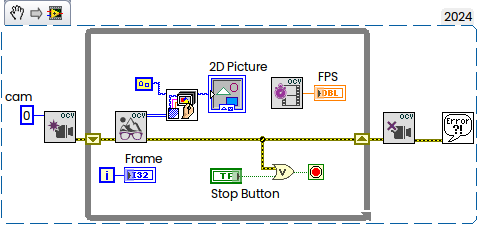
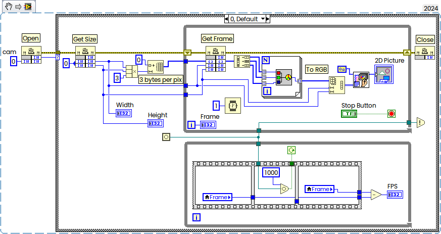

# OpenCVcamLV
Update 24-Nov-2024:

* CLFNs turned to SubVIs
* Error handling added

Grab Example:

[Source Code Snapshot](https://github.com/AndrDm/OpenCVcamLV/archive/refs/tags/v.0.2.zip).

22-Nov-2024:

Example how to perform acquisition with OpenCV in LabVIEW for [NI Forum](https://forums.ni.com/t5/LabVIEW/Labview-community-and-IMAQdx/m-p/4410512#M1299707):

LabVIEW 2024 Q3, downgraded to LV2018 + Visual Studio 2022 v.17.12.1 + [OpenCV 4.10.0](https://github.com/opencv/opencv/releases/tag/4.10.0).

[Source Code](https://github.com/AndrDm/OpenCVcamLV/archive/refs/tags/v.0.1.zip).

x64 only.

